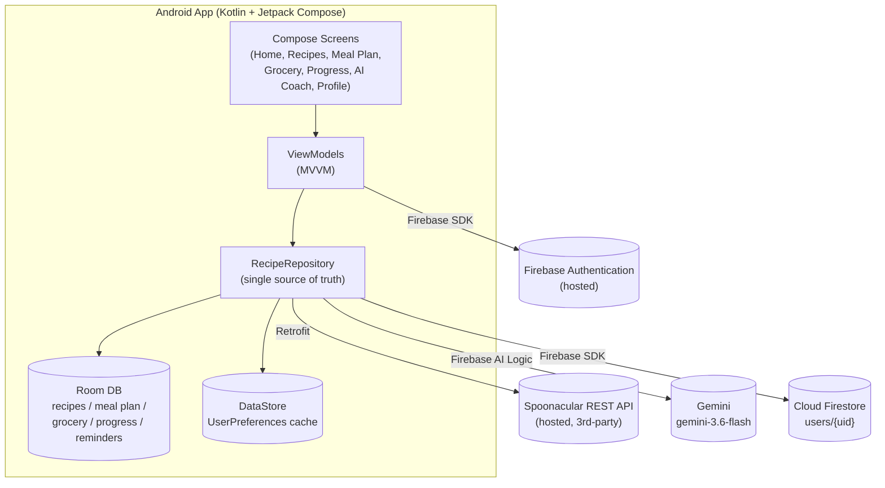

# 🥄 SpoonSage

**Plan meals, shop smarter, and get coached — all in one Android app.**

SpoonSage is a Kotlin/Jetpack Compose Android app prototype built for the IIE
*App Prototype Development* assessment (Learning Units 1 & 2). It combines
recipe discovery, meal planning, a grocery list, progress tracking, and an
AI-powered nutrition coach, backed by Firebase for authentication and cloud
data sync.

[](https://github.com/<YOUR_GITHUB_USERNAME>/SpoonSage/actions/workflows/build.yml)


> Replace `<YOUR_GITHUB_USERNAME>` above (and in the clone command below)
> with your actual GitHub username/org once this is pushed.

---

## Table of Contents

- [Purpose](#purpose)
- [Design Considerations](#design-considerations)
- [Features](#features)
- [Screenshots](#screenshots)
- [Tech Stack & Architecture](#tech-stack--architecture)
- [REST API & Hosted Services](#rest-api--hosted-services)
- [Setup & Installation](#setup--installation)
- [GitHub Actions (CI)](#github-actions-ci)
- [Testing](#testing)
- [Demonstration Video](#demonstration-video)
- [AI Usage Disclosure](#ai-usage-disclosure)
- [Author](#author)

---

## Purpose

Meal planning is tedious to do well: juggling what's in the fridge, what fits
a diet, what's actually nutritious, and turning that into a shopping list.
**SpoonSage's target audience** is anyone trying to eat more intentionally —
students and young professionals in particular — who wants a single app that
plans meals *and* nudges them toward their goals, instead of a spreadsheet
plus three different apps.

SpoonSage solves this by combining:
- real recipe data (via the Spoonacular API),
- a lightweight meal plan and auto-generated grocery list, and
- an AI Coach that gives short, practical nutrition advice on request.

## Design Considerations

- **Architecture:** MVVM (Model-View-ViewModel), the standard recommended
  pattern for Jetpack Compose apps. Compose screens observe `StateFlow`/
  Compose state exposed by ViewModels; ViewModels talk to a single shared
  `RecipeRepository`, never to the database or network directly.
- **Offline-first:** Room is the local source of truth for recipes, the meal
  plan, grocery list, progress logs, and reminders, so the app stays usable
  without a connection. `DataStore` (`UserPreferences`) caches small profile
  values (personal info, goals, diet) locally and mirrors them to Firestore.
- **Manual dependency injection:** a single `AppViewModelFactory` and one
  `SpoonSageApp.repository` instance are shared across screens, instead of
  Hilt/Dagger — kept simple and easy to trace for a prototype of this size.
- **Why Firebase:** Authentication + Firestore were chosen over a
  self-built Node/Express backend so the assessment's "connect to a hosted
  REST/backend service with a database" requirement is met with a
  production-grade, genuinely hosted service, without needing to also run
  and pay to keep a custom server online for marking.
- **Why Gemini via Firebase AI Logic:** the AI Coach originally called the
  Anthropic API directly; it was switched to Gemini through **Firebase AI
  Logic** (`GenerativeBackend.googleAI()`) because that backend has a real
  free tier with no Cloud billing account required, and it reuses the same
  Firebase project as Auth/Firestore rather than needing a separate paid key.

## Features

| Feature | Status | Notes |
|---|---|---|
| Recipe search (by ingredient & by query/diet) | ✅ Implemented | Spoonacular REST API |
| Recipe detail (ingredients, steps, nutrition) | ✅ Implemented | |
| Meal planning (assign recipes to days) | ✅ Implemented | Room-backed |
| Auto-generated grocery list | ✅ Implemented | Room-backed |
| Progress tracking (calories/protein/water + streak) | ✅ Implemented | Room-backed |
| Reminders (meal/water/weigh-in) | ✅ Implemented | Room-backed |
| AI Coach chat with dish suggestions | ✅ Implemented | Gemini via Firebase AI Logic |
| Sign up / log in with encrypted password | ✅ Implemented | Firebase Authentication (password never touches app code) |
| Continue as guest | ✅ Implemented | Firebase anonymous auth |
| Settings / profile editing (personal info, goals, diet) | ✅ Implemented | Syncs to Firestore |
| Cloud sync of profile across devices | ✅ Implemented | Cloud Firestore |
| Push notifications for reminders | ⏳ Deferred to final PoE | Local reminders exist; OS-level notification triggers not yet wired up |
| Social sharing of meal plans | ⏳ Deferred to final PoE | |
| Multi-language support | ⏳ Deferred to final PoE | |

> Adjust the "Deferred" rows to match whatever your own design document
> actually lists — these are placeholders for typical PoE-stage features.

## Screenshots

<!-- Replace these with real screenshots before submitting -->
| Home | AI Coach | Meal Plan |
|---|---|---|
|  |  |  |

## Tech Stack & Architecture

**Language & UI:** Kotlin, Jetpack Compose, Material 3, Navigation Compose
**Local storage:** Room (offline cache), DataStore (small preference values)
**Networking:** Retrofit + OkHttp + Gson (Spoonacular)
**Cloud services:** Firebase Authentication, Cloud Firestore, Gemini via
Firebase AI Logic
**Async:** Kotlin Coroutines & Flow
**Images:** Coil
**Testing:** JUnit4, MockK, kotlinx-coroutines-test, Google Truth
**CI/CD:** GitHub Actions



## REST API & Hosted Services

SpoonSage uses **two** hosted, internet-based services, both connected to
real databases, satisfying the "connect to a REST API/backend with a
database" requirement:

### 1. Spoonacular (third-party REST API → recipe database)

Base URL: `https://api.spoonacular.com/`

| Endpoint | Method | Used for |
|---|---|---|
| `/recipes/findByIngredients` | GET | Search recipes by ingredients the user already has |
| `/recipes/complexSearch` | GET | Search by name/cuisine, filtered by diet & intolerances |
| `/recipes/{id}/information` | GET | Full recipe detail: ingredients, steps, nutrition |

Example request (ingredient search):
```
GET https://api.spoonacular.com/recipes/findByIngredients
    ?ingredients=chicken,rice,broccoli
    &number=15
    &apiKey=YOUR_SPOONACULAR_API_KEY
```

Example response (trimmed):
```json
[
  { "id": 632660, "title": "Chicken Fried Rice", "image": "https://...jpg" }
]
```

### 2. Firebase (hosted auth + hosted NoSQL database)

- **Firebase Authentication** — hosted identity service; handles account
  creation, password hashing/encryption, and session tokens. The app never
  stores or hashes passwords itself.
- **Cloud Firestore** — hosted NoSQL database. User profile, goals, and
  dietary preferences are stored per-user at `users/{uid}`.
- **Firebase AI Logic (Gemini)** — hosted model inference for the AI Coach;
  see `GeminiCoachClient.kt`.

Full one-time console setup for all three is documented in
[`SETUP_FIREBASE.md`](SETUP_FIREBASE.md).

> For the demonstration video: show the Firebase console's **Authentication**
> tab (registered users), **Firestore** tab (a `users/{uid}` document with
> synced profile data), and a Spoonacular API response (e.g. via Logcat or
> the app's recipe search screen) to satisfy the "show what data is stored
> in the hosted auth service, API, and database" requirement.

## Setup & Installation

1. **Clone the repo:**
   ```bash
   git clone https://github.com/<YOUR_GITHUB_USERNAME>/SpoonSage.git
   cd SpoonSage
   ```
2. **Get a free Spoonacular API key:** https://spoonacular.com/food-api →
   paste it into `app/build.gradle.kts`, replacing
   `YOUR_SPOONACULAR_API_KEY_HERE`.
3. **Set up Firebase** (Auth, Firestore, AI Logic) and drop your own
   `app/google-services.json` into the `app/` folder — full walkthrough in
   [`SETUP_FIREBASE.md`](SETUP_FIREBASE.md).
4. **Open in Android Studio** (Hedgehog or newer), let Gradle sync, then
   **Run ▶** on an emulator or device (minSdk 24 / Android 7.0+).

## GitHub Actions (CI)

[`.github/workflows/build.yml`](.github/workflows/build.yml) runs
automatically on every push and pull request to `main`:

1. Checks out the code.
2. Writes `app/google-services.json` from a repository secret
   (`GOOGLE_SERVICES_JSON`, base64-encoded) — this keeps the real file out
   of the repo (see `.gitignore`) while still letting CI build the app.
3. Sets up JDK 17 and caches Gradle dependencies for faster runs.
4. Runs `./gradlew testDebugUnitTest` — all unit tests must pass.
5. Runs `./gradlew assembleDebug` — the app must compile.
6. Uploads the unit test report and the built debug APK as workflow
   artifacts, and fails the run with the full stack trace in the logs if
   either step fails.

**Why:** this proves the app builds and its tests pass on a clean machine,
not just "on my computer" — catching missing files, dependency issues, or
untested regressions before they reach a reviewer.

**One-time setup required:** add a repository secret named
`GOOGLE_SERVICES_JSON` containing the base64-encoded contents of your
`google-services.json` (Settings → Secrets and variables → Actions → New
repository secret). Instructions are also in the workflow file's comments.

## Testing

Unit tests live under `app/src/test/java/com/spoonsage/app/` and run on the
plain JVM (no emulator needed), using JUnit4, MockK (for mocking Firebase),
and Google Truth (for readable assertions):

| Test class | Covers |
|---|---|
| `CoachReplyParserTest` | Parsing Gemini's raw AI Coach reply into chat text + an optional dish suggestion |
| `StreakCalculatorTest` | Daily-logging streak rules (same day / next day / gap) |
| `AuthValidatorTest` | Sign up / login input validation rules |
| `AuthViewModelTest` | AuthViewModel rejects invalid input *before* ever calling Firebase |

**Run them:**
```bash
./gradlew testDebugUnitTest
```
Reports are written to `app/build/reports/tests/testDebugUnitTest/index.html`.

## Demonstration Video

📺 [VIDEO LINK HERE]

The video (with voice-over) shows: registering and logging in with an
encrypted password, changing settings, the app calling the Spoonacular REST
API, the AI Coach, and the data stored in Firebase Authentication and
Firestore.

## AI Usage Disclosure

<!-- Max 500 words. Replace with your own account of how AI tools were
     used and cited — e.g. Claude for scaffolding the Firebase migration,
     debugging Gradle errors, drafting this README/CI workflow, etc. -->
[AI USAGE DISCLOSURE — TO BE FINALISED]

## Author

**Mulamuleli Given Mutshotsho** ("Given") — IIE Faculty of ICT
*App Prototype Development — Learning Units 1 & 2*
